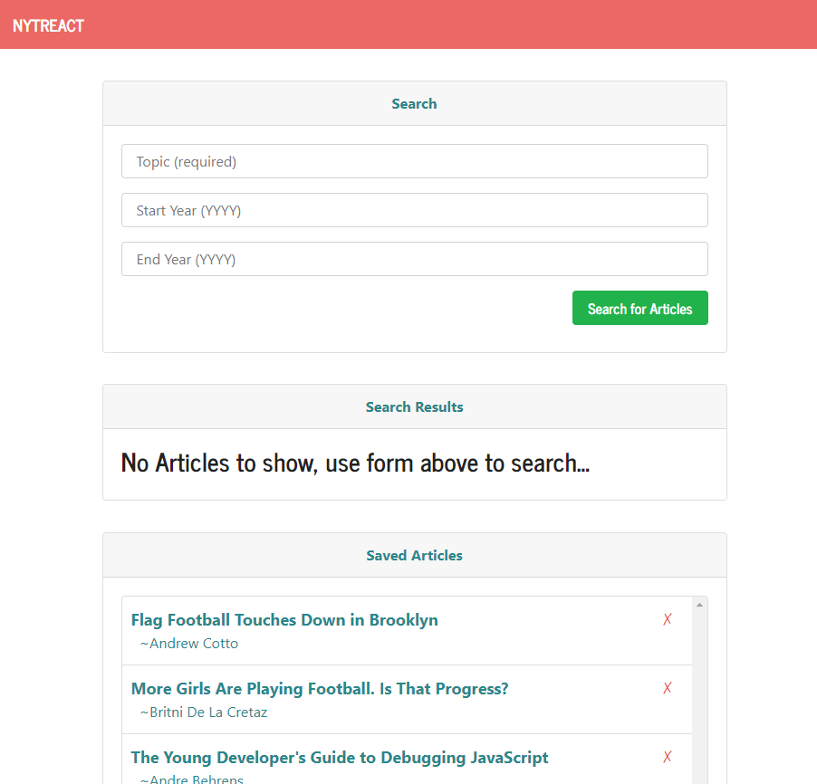

# New York Times React App
This MERN (Mongo, Express, React, Node) Fullstack application allows users to search the New York times for articles and save selected articles to MongoDB in order to read later.

### Click [here](https://dmeeks-nytreact.herokuapp.com/) to view the live demo.
